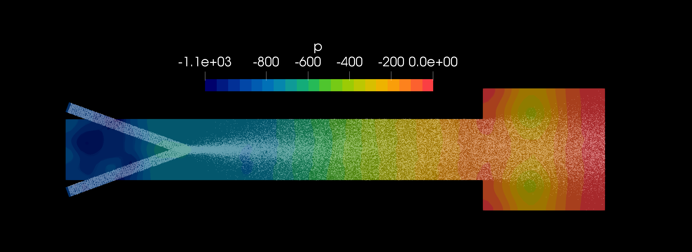

# Particle-Based Injection Channel Simulation using MPPICFoam

This OpenFOAM case models particle-laden flow within a channel where particles are continuously injected into a fluid stream. Using **MPPICFoam**, a solver for multiphase particle-in-cell (MPPIC) simulations, this setup examines the interactions between a dispersed solid phase (particles) and the continuous carrier fluid. 
This simulation is based on the Openfoamv2012 tutorial case with minor adjustments.

## Case Structure

- **0/**: Initial conditions for the carrier phase (velocity, pressure) and particles (positions, velocities).
- **constant/**: 
  - `polyMesh/`: Contains the mesh setup for the channel geometry.
  - `properties`: Files defining the particle properties and carrier phase.
- **system/**: Settings for the simulation, including the control of time-stepping, discretization schemes, and solvers.

## Running the Simulation
1. **Run blockmeshdict
2. **Run MPPICFoam
